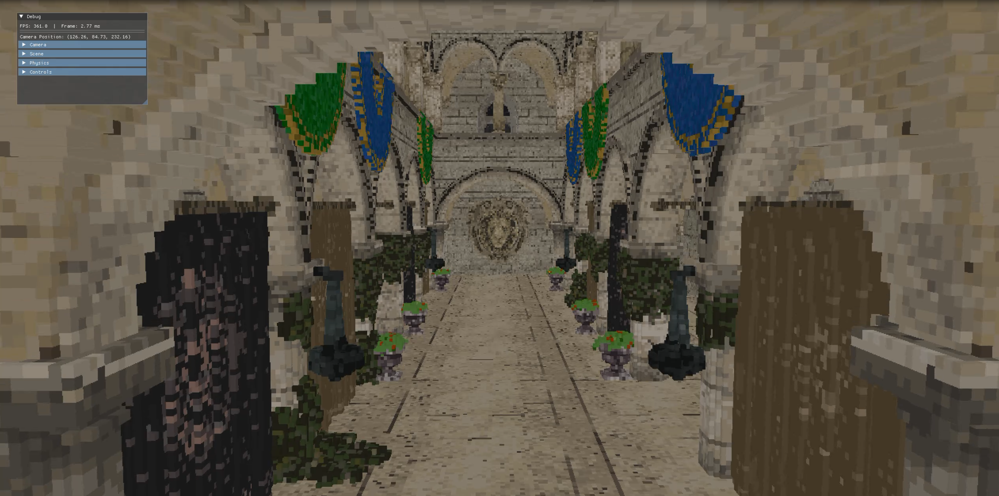

# Cube Engine V1.0.0

The cube Engine is a Voxel game engine that renders voxels directly to the screen rather than tradition traingle rasterization

Visual Studio 2022 is recommended

1. Downloading the repository:

    //no build yet

2. Configuring the dependencies:

    //no build yet

# Current Main Features:

    Ui(using imgui library)
    Voxel physics solver and collider system(using Bullet-Physics library)
    Support for Windows(Renderering api is Vulkan)
    Fully custom Voxel rendering algorithim
    Voxel traversal optimization(BrickMaps)
    Hard Shadows using raytracing
    Voxel Model loading and saving
    Audio system
    Voxel alteration and destruction

# Future goals for this project:

Note: this may change in the Future.

by sometime 2027, i plan to have made a full micro voxel game using this game engine. However this means that there are still many more tools and features that must be added, features including:

    Built in lod
    memory optimizations 
    custom voxel collision system
    Voxel Octree Implementation
    Fluid System(using cellular automata)
    Global illumination

# In engine graphics test screenshot:

# Technical Renderer Explanation
The Engine is created in C++ and uses the Vulkan graphics api; each voxel is represented by 8 bytes, allowing each voxel object to have a 255-color palette. Each brick is a data representation of an 8x8x8 area of voxels and only stores one occupancy integer, which lets the renderer determine if the region is full, empty, or mixed. Then a compute shader takes in the brick and voxel information about each object and uses the DDA ray traversal algorithm to step through each brick; then, if necessary, the DDA ray will start traversal on the voxel level. This traversal then returns a pixel color after completing traversal(a ray is initialized from every pixel on the screen). After the pixel color is returned, a secondary ray is cast from the ray hit position to the sun in order to create hard shadows. 

Usefull resources:

)

