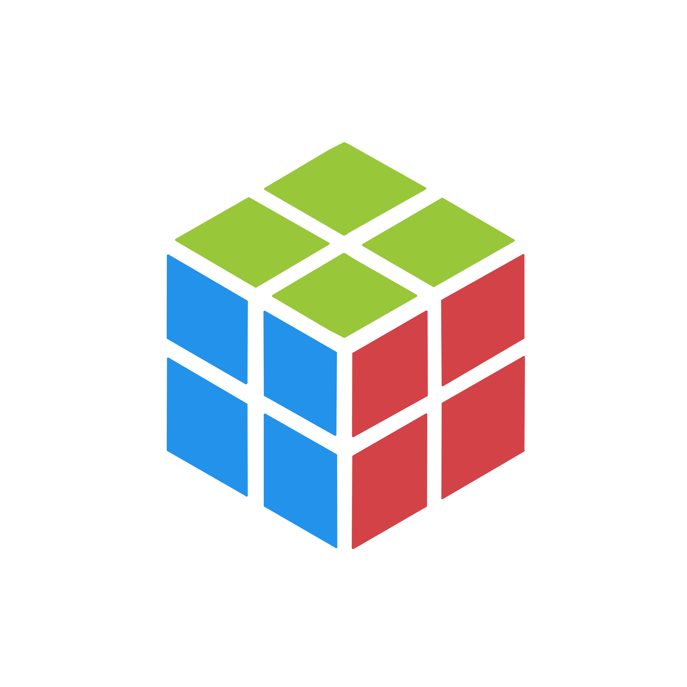

Cube

The cube Engine is a Voxel game engine that renders voxels directly to the screen rather than tradition traingle rasterization

Visual Studio 2022 is recommended

1. Downloading the repository:

    //no build yet

2. Configuring the dependencies:

    //no build yet

Current Main Features:

    Ui(using imgui library)
    Voxel physics solver and collider system(using Bullet-Physics library)
    Support for Windows(Renderering api is Vulkan)
    Fully custom Voxel rendering algorithim
    Voxel traversal optimization(BrickMaps)
    Hard Shadows using raytracing
    Voxel Model loading and saving
    Audio system
    Voxel alteration and destruction

Future goals for this project:

Note: this may change in the Future.

by sometime 2027, i plan to have made a full micro voxel game using this game engine. However this means that there are still many more tools and features that must be added, features including:

    Built in lod
    memory optimizations 
    custom voxel collision system
    Voxel Octree Implementation
    Fluid System(using cellular automata)
    Global illumination

